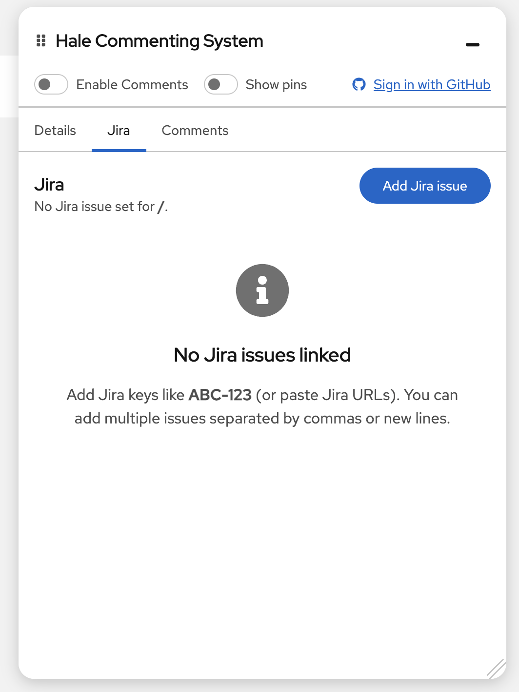
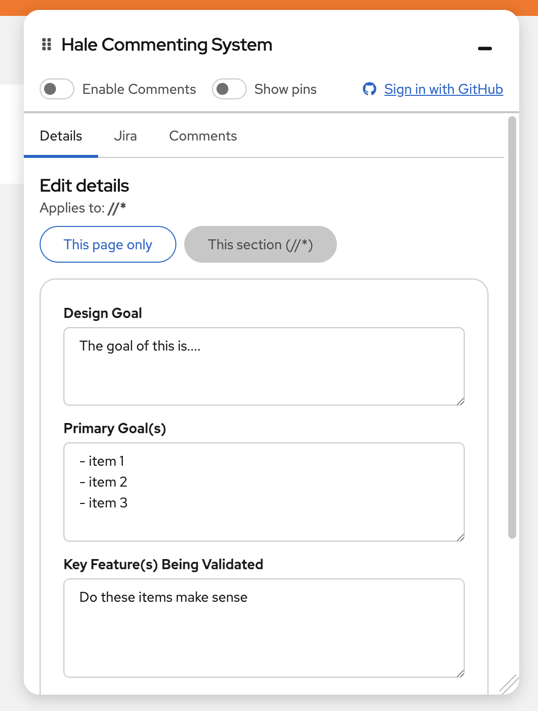
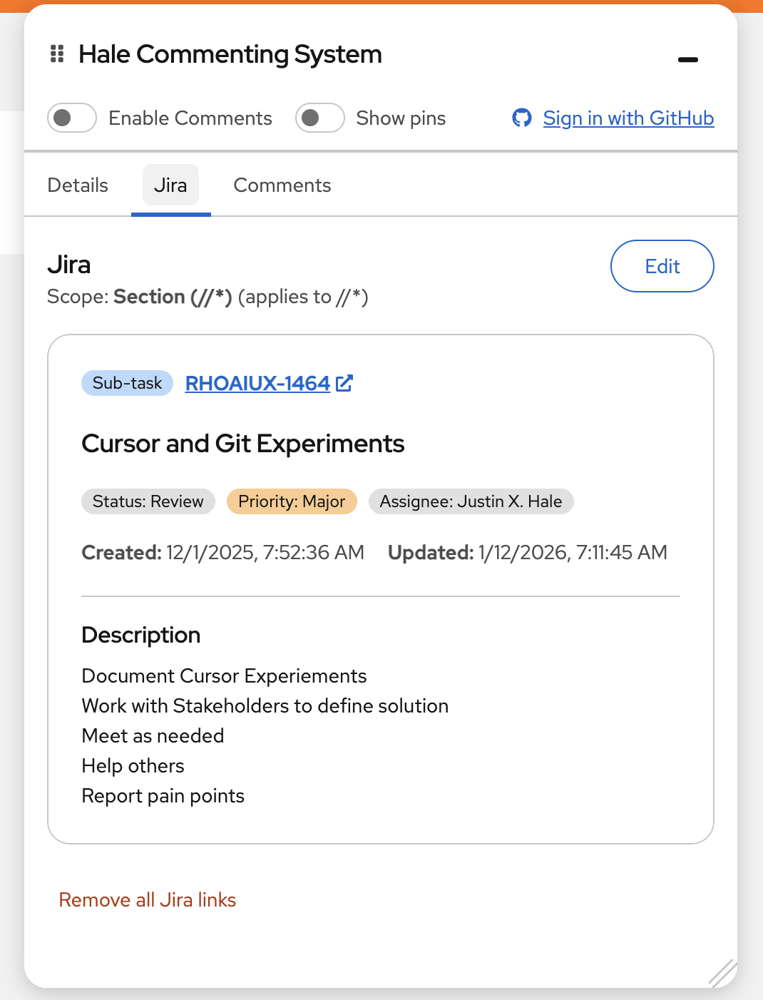

# Hale Commenting System

A commenting system for PatternFly React applications that allows designers and developers to add comments directly on design pages, sync with GitHub Issues, and link Jira tickets.



## 🚨 Important: Proper Uninstall Required

**This package modifies your project files during setup.** Before uninstalling, you MUST run:
```bash
npx hale-commenting-system remove
npm uninstall hale-commenting-system
```

Failure to run `remove` first will break your app. See [Uninstalling](#uninstalling) for details.

## Key Features

- **React Component Detection** - Automatically identifies React components with names, types, props, and component tree paths
- **Smart Pin Positioning** - Pins anchor to elements using CSS selectors and follow them on scroll/resize
- **Hover Preview** - Visual preview with dashed border before creating a comment
- **Component Highlighting** - Chrome DevTools-style blue border on selected components
- **Resizable Widget** - Adjustable panel size (300-800px width)
- **Thread Discussions** - Organized comment threads with replies
- **GitHub Integration** - Automatic sync with GitHub Issues including component metadata
- **Jira Integration** - Link tickets to specific pages or sections
- **Missing Element Detection** - Pins fade and show [deleted] when target is removed

## Prerequisites

This package was developed for **PatternFly React Seed** projects, but can be used with similar PatternFly React applications that have:
- Webpack-based setup with `webpack.dev.js`
- `src/app/` directory structure
- PatternFly React Core and Icons dependencies

The automated integration script (`npx hale-commenting-system init`) works best with PatternFly React Seed or projects with a similar structure.

## Quick Start

```bash
# Install
npm install hale-commenting-system

# Run setup
npx hale-commenting-system init

# Start dev server
npm run start:dev
```

The interactive setup will guide you through configuring GitHub OAuth and Jira integration (both optional).

## Uninstalling

**Always remove integration before uninstalling:**

```bash
# Step 1: Remove integration
npx hale-commenting-system remove

# Step 2: Uninstall package
npm uninstall hale-commenting-system

# Step 3: Restart
npm run start:dev
```

### Already Uninstalled by Mistake?

If your app is broken after uninstalling without running `remove`:

```bash
npm install hale-commenting-system
npx hale-commenting-system remove
npm uninstall hale-commenting-system
```

<details>
<summary>What the removal script does</summary>

- Removes imports from `src/app/index.tsx`
- Removes imports from `src/app/AppLayout/AppLayout.tsx`
- Notifies about webpack middleware (may require manual removal)
- Keeps `.env` and `.env.server` files
</details>

## Usage

### Creating Comments

1. **Hover** over any component to see a preview with a dashed blue border and component label
2. **Click** to attach a comment pin - the system detects React components automatically
3. **View** component details in the panel including name, type, tree path, and props



### Managing Comments

- **Toggle visibility** - Enable/disable comments or use "Show pins" to view without creating new ones
- **Resize widget** - Drag the resize handle (300-800px width, 200px to viewport height)
- **Pin behavior** - Pins follow elements on scroll/resize; fade to 40% opacity if element is deleted
- **Thread discussions** - Reply to comments, close/reopen threads, view all in sidebar
- **Remove pins** - Delete comment threads as needed

### How It Works

The system uses a **hybrid approach**:

**React Component Detection** (Primary)
- Detects components using React fiber nodes
- Extracts name, type, props, and component tree path
- Works with all React component types including HOCs

**CSS Selector Fallback**
- Uses `data-testid`, `id`, or tag + class + aria attributes
- Stores coordinates as fallback if element is deleted

### Integrations

**GitHub** (Optional)
- Comments sync as GitHub Issues with component metadata
- Replies sync as issue comments
- Status changes (open/closed) sync bidirectionally

**Jira** (Optional)
- Link Jira tickets to specific pages or sections
- View ticket details in the commenting panel
- Track design work alongside development



## Configuration

**`.env`** (client-side, safe to commit)
- GitHub OAuth client ID, Jira base URL

**`.env.server`** (server-side secrets, auto-added to `.gitignore`)
- GitHub OAuth client secret, Jira API tokens

## Requirements

- PatternFly React Seed project (or compatible PatternFly React app)
- Node.js 18+ (for webpack middleware with native `fetch()`)
- React 18+

## What Gets Modified

The `init` script automatically updates:
- `src/app/index.tsx` - Adds providers
- `src/app/routes.tsx` - Adds Comments route
- `src/app/AppLayout/AppLayout.tsx` - Adds panel and overlay components
- `webpack.dev.js` - Adds OAuth/Jira proxy middleware
- Creates `src/app/Comments/Comments.tsx` and config files

## Local Testing

<details>
<summary>Click to expand testing instructions</summary>

### Using npm link (Recommended)

```bash
# In package directory
npm run build && npm link

# In test app
npm link hale-commenting-system
npx hale-commenting-system init
npm run start:dev

# Clean up when done
npx hale-commenting-system remove
npm unlink hale-commenting-system && npm install
```

### Using npm pack

```bash
# In package directory
npm run build && npm pack

# In test app
npm install /path/to/hale-commenting-system-*.tgz
npx hale-commenting-system init
npm run start:dev
```

### Test Checklist
- Hover preview and pin creation
- Component detection (name, type, path, props)
- Pin positioning and dynamic tracking
- Widget resizing and toggles
- Element deletion handling
- Comments, replies, and GitHub/Jira sync
</details>

## Development

```bash
npm install          # Install dependencies
npm run start:dev    # Start dev server
npm run build        # Production build
```

## License

MIT

## Support

For issues or questions, please open an issue on GitHub or npm.
